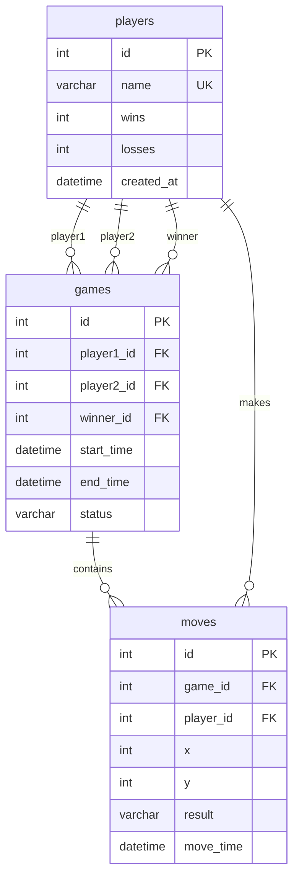

# ER-диаграмма базы данных

```mermaid
erDiagram
    players ||--o{ games : player1
    players ||--o{ games : player2
    players ||--o{ games : winner
    games ||--o{ moves : contains
    players ||--o{ moves : makes

    players {
        int id PK
        varchar name UK
        int wins
        int losses
        datetime created_at
    }

    games {
        int id PK
        int player1_id FK
        int player2_id FK
        int winner_id FK
        datetime start_time
        datetime end_time
        varchar status
    }

    moves {
        int id PK
        int game_id FK
        int player_id FK
        int x
        int y
        varchar result
        datetime move_time
    }
```
